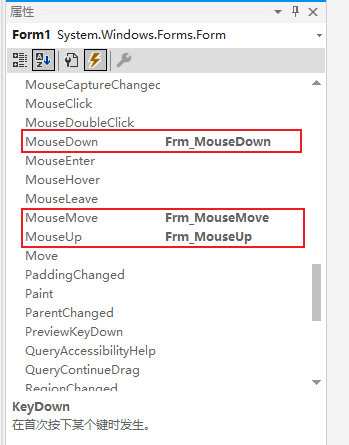

# Winform有/无边框鼠标拖动任意位置移动窗体
### 1.在Program.cs中添加如下代码
```c#
  #region 窗体移动

        private Point mouseOff;//鼠标移动位置变量
        private bool leftFlag;//标签是否为左键
        private void Frm_MouseDown(object sender, MouseEventArgs e)
        {
            if (e.Button == MouseButtons.Left)
            {
                mouseOff = new Point(-e.X, -e.Y); //得到变量的值
                leftFlag = true;                  //点击左键按下时标注为true;
            }
        }
        private void Frm_MouseMove(object sender, MouseEventArgs e)
        {
            if (leftFlag)
            {
                Point mouseSet = Control.MousePosition;
                mouseSet.Offset(mouseOff.X, mouseOff.Y);  //设置移动后的位置
                Location = mouseSet;
            }
        }
        private void Frm_MouseUp(object sender, MouseEventArgs e)
        {
            if (leftFlag)
            {
                leftFlag = false;//释放鼠标后标注为false;
            }
        }
 #endregion
```

### 2.绑定窗体事件
如下图所示


