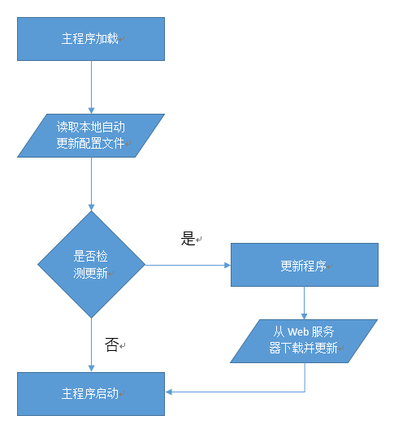
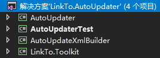
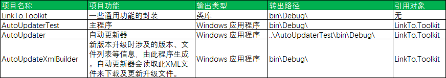

# C# WinForm通用自动更新器
## 一、引言
对于C/S架构来说，软件更新是一个很常用的功能，下面介绍一种非常实用的软件自动升级方案。

## 二、示意图

## 三、项目说明
### 3.1、项目创建
新建4个项目，如下所示：

### 3.2、项目关系

## 四、LinkTo.Toolkit
LinkTo.Toolkit主要是一些Utility及Helper类文件，实现转换扩展、文件读写、进程处理等功能。
